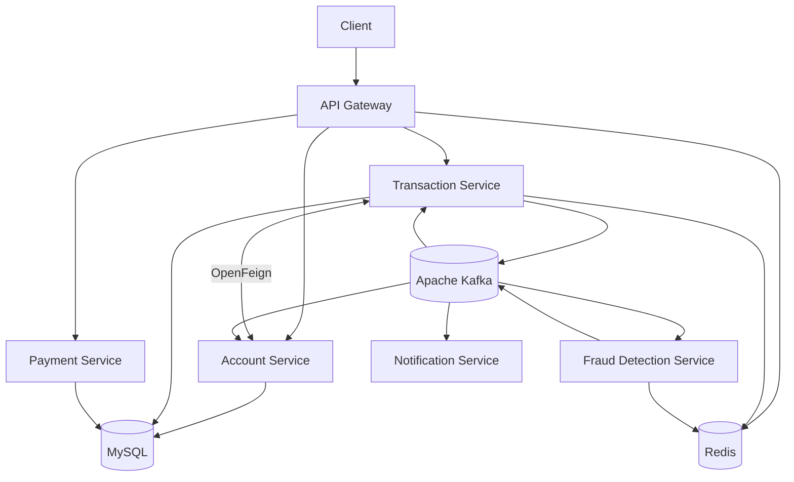

# Banking System Architecture

```mermaid
flowchart TD
    A[Client] --> B[API Gateway]

    B --> C[Account Service]
    B --> D[Transaction Service]
    B --> E[Payment Service]

    D <-->|OpenFeign| C

    D --> F[(Apache Kafka)]
    F --> G[Fraud Detection Service]
    G --> F

    F --> D
    F --> C
    F --> H[Notification Service]

    B --> I[(Redis)]
    D --> I
    G --> I

    C --> J[(MySQL)]
    D --> J
    E --> J
```
